# Writing a Rust Roguelike for Desktop and the Web

This is a template for a Roguelike written in [Rust][rust]. You can
build it for Windows, macOS, Linux and the Web
(via [WebAssembly][wasm]).

[rust]: https://www.rust-lang.org/
[wasm]: https://webassembly.org/

If you want to dive right in, just clone this repo and run it. Or read
on for a detailed guide.

## Motivation

Rust is a pretty good language for writing roguelikes: it is fast,
modern (modules, closures, fast collections, powerful macros, great
enums) and it can build standalone executables for all the major
platforms as well as the web!

The last bit is especially cool for game jams -- you don't have to
worry about software packaging and distribution. Just give people a
URL and they can play your game.

We're going to build a skeleton for a traditional ASCII roguelike. You
can take it and turn it into a real game. The same codebase will work
for all three the major platforms as well as the web. And it will
support multiple fonts and text sizes so you can have your square maps
and readable text *at the same time*!

It will look like this:

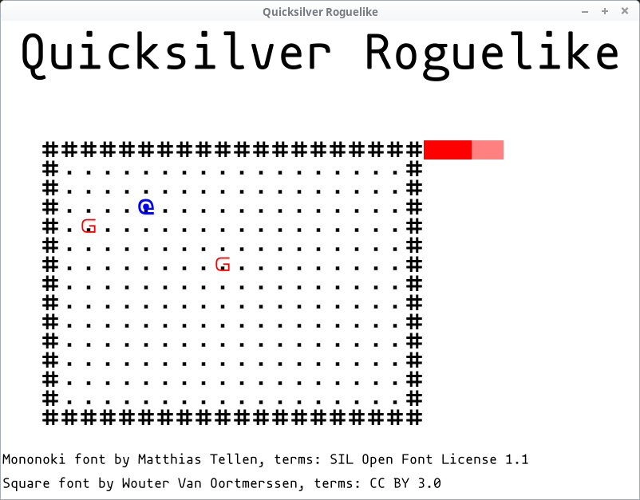

You can try the web build here:

https://tomassedovic.github.io/quicksilver-roguelike/


## Setup

### Rust

You will need the 2018 edition of Rust to get started. Get it from the
Rust website:

https://www.rust-lang.org/learn/get-started

> You'll want `rustup` (it should be the default) -- we'll need it for
> the WebAssembly backend.


### WebAssembly

WebAssembly is a new bytecode format supported in all modern desktop
browsers. It's faster than JavaScript and various languages (including
Rust) can be compiled into it.

The WebAssembly compilation target is not shipped by default, but you
can add it like so:

    $ rustup target add wasm32-unknown-unknown

> You don't need this if you only care about the desktop.


### cargo-web

[cargo-web](https://github.com/koute/cargo-web) handles everything you
need to ship your game on the web. Install it like so:

    $ cargo install cargo-web

> You don't need this if you only care about the desktop.


### Repository

Create a new project like so:

    $ cargo new --vcs git roguelike

> This will initialise a new git repository as well! Remove `--vcs
> git` if you don't want that.

If you've got everything set up properly, you should be able to run
the default program:

    $ cd roguelike
    $ cargo run --release

It will print:

```
$ cargo run --release
   Compiling roguelike v0.1.0 (/home/thomas/tmp/roguelike)
    Finished release [optimized] target(s) in 0.92s
     Running `target/release/roguelike`
Hello, world!
```


## Quicksilver

Rust has several gamedev engines and frameworks. We are going to
use [Quicksilver](https://www.ryanisaacg.com/quicksilver/) because it
lets you target both the desktop and web really easily!

Open your `Cargo.toml` in the root of your repository and add this at
the end:

```toml
[dependencies]
# More features: "collisions", "complex_shapes", "immi_ui", "sounds", gamepads
quicksilver = { version = "0.3.6", default-features = false, features = ["fonts", "saving"]}
```

We're disabling most of the features. You don't have to do this, but
some of these require libraries you might not have installed. The
above should compile pretty much anywhere.

You can always add the sound or gamepad support later if you need it.

Run the program again to build the quicksilver dependency:

    $ cargo run --release

This might take a couple of minutes. It should print out the same
hello world message as before.

> We'll be always building the optimised version in this guide. You
> can drop the `--release` flag but if you do, you're *not allowed* to
> make any speed measurements. Rust's debug builds are slower than you
> think. They're slower than unoptimised C++. They're slower than
> Ruby.


## Hello, Game!

The first thing we'll do is create a window and print some text on it.
We'll do all our coding in the [`src/main.rs` file][main.rs] in the
game repository. It's less than 300 lines total.

[main.rs]: https://github.com/tomassedovic/quicksilver-roguelike/blob/guide/src/main.rs

### Empty Window

A Quicksilver app is all encapsulated in an item that implements the
[`quicksilver::lifecycle::State` trait][state]:

[state]: https://docs.rs/quicksilver/0.3.5/quicksilver/lifecycle/trait.State.html

```rust
struct Game;

impl State for Game {
    /// Load the assets and initialise the game
    fn new() -> Result<Self> {
        Ok(Self)
    }

    /// Process keyboard and mouse, update the game state
    fn update(&mut self, window: &mut Window) -> Result<()> {
        Ok(())
    }

    /// Draw stuff on the screen
    fn draw(&mut self, window: &mut Window) -> Result<()> {
        Ok(())
    }
}
```

Our game code will go into the three methods above.

To run the game add the above to `main.rs` and replace the `main`
function with:

```rust
fn main() {
    let settings = Settings {
        ..Default::default()
    };
    run::<Game>("Quicksilver Roguelike", Vector::new(800, 600), settings);
}
```

The [`Settings` struct][settings] lets us control various engine
settings that we'll get to later. The `800` and `600` numbers
represent the **logical** size of your window. Depending on your DPI
settings, it might be bigger than that.

[settings]: https://docs.rs/quicksilver/0.3.5/quicksilver/lifecycle/struct.Settings.html

And finally, we need to bring all the items we use into scope. Put
this at the top of your file:

```rust
use quicksilver::{
    geom::Vector,
    lifecycle::{run, Settings, State, Window},
    Result,
};
```

Running the game should now produce an empty window filled with black:

    $ cargo run --release

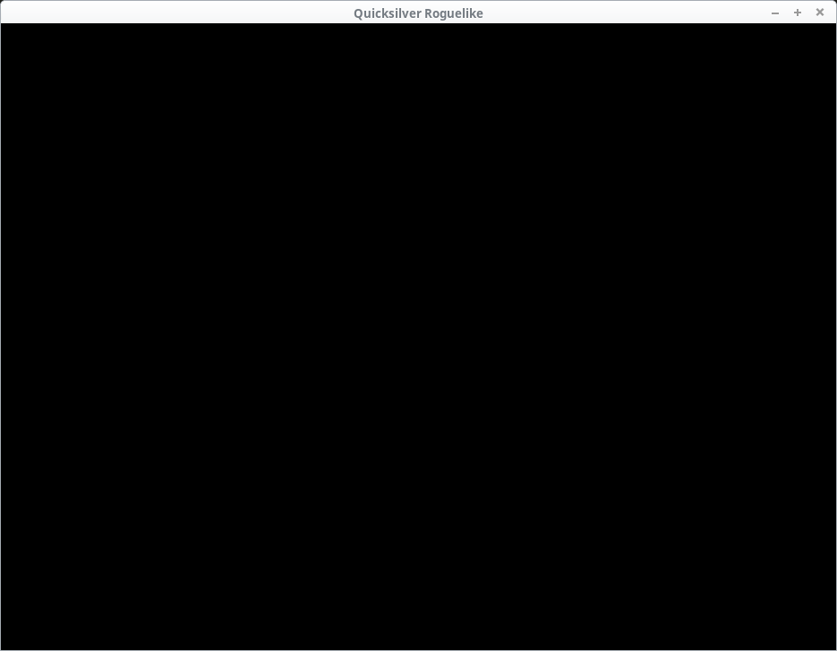

### Assets

You may have noticed the following message when running the code:

```
Warning: no asset directory found. Please place all your assets inside
a directory called 'static' so they can be loaded
Execution continuing, but any asset-not-found errors are likely due to
the lack of a 'static' directory.
```

Quicksilver expects all the game assets to be in the `static`
directory under the project's root. We don't have one, hence the
warning.

Let's create it:

    $ mkdir static

Our repo should now look like this:

```
├── Cargo.lock
├── Cargo.toml
├── src
│   └── main.rs
├── static
└── target
    └── release
```

What goes into `static`? Sounds, images, models, maps and anything
else your game will need to load. Including fonts.

Let's use mononoki, a beautiful little monospace font. Go to
the [mononoki website][mononoki] and download it.

[mononoki]: https://madmalik.github.io/mononoki/

It is an [open source](https://github.com/madmalik/mononoki) font
created by Matthias
Tellen
[distributed under the Open Font License 1.1](https://github.com/madmalik/mononoki/blob/master/LICENSE).

Unpack it and copy the `mononoki-Regular.ttf` file into our new
`static` directory.


### Loading the font

All initial asset loading should happen in the `new` function. We will
load the font file, use it to render text into an image and store it
in our `Game` struct:

```rust
fn new() -> Result<Self> {
    let font_mononoki = "mononoki-Regular.ttf";

    let title = Asset::new(Font::load(font_mononoki).and_then(|font| {
        font.render("Quicksilver Roguelike", &FontStyle::new(72.0, Color::BLACK))
    }));

    let mononoki_font_info = Asset::new(Font::load(font_mononoki).and_then(|font| {
        font.render(
            "Mononoki font by Matthias Tellen, terms: SIL Open Font License 1.1",
            &FontStyle::new(20.0, Color::BLACK),
        )
    }));

    Ok(Self)
}
```

We're rendering two bits of text: a heading 72 points big and the
font's credits.

> Thanks, Matthias!

[`Font::load`][font_load] returns a [`Future`][future]. It exits
immediately and loads the actual file in the background.
Calling [`and_then`][and_then] will let us manipulate the value (font)
when it's ready.

[font_load]: https://docs.rs/quicksilver/0.3.5/quicksilver/graphics/struct.Font.html#method.load

[future]: https://docs.rs/quicksilver/0.3.5/quicksilver/combinators/trait.Future.html

[and_then]: https://docs.rs/quicksilver/0.3.5/quicksilver/combinators/trait.Future.html#method.and_then

> Quicksilver does dynamic asset loading for us!

Note that, "render" here doesn't mean "draw onto the
screen". [`font.render`][font_render] takes a text and a style (font
size & colour) and creates an image we can draw later.

[font_render]: https://docs.rs/quicksilver/0.3.5/quicksilver/graphics/struct.Font.html#method.render

Font rendering takes a lot computational of work. It has to rasterise
the glyphs, handle kerning, etc. Drawing an image is much faster. So
we do all the hard work once, store the results and then just draw a
static image later.

To make both of our images (title and the credits) available to the
`draw` method, we'll store them in the `Game` struct:

```rust
struct Game {
    title: Asset<Image>,
    mononoki_font_info: Asset<Image>,
}
```

And return them from `new`:

```rust
Ok(Self {
    title,
    mononoki_font_info,
})
```

We also need to a few new imports from `quicksilver`:

```rust
use quicksilver::{
    geom::Vector,
    graphics::{Color, Font, FontStyle, Image},
    lifecycle::{run, Asset, Settings, State, Window},
    Future, Result,
};
```

(we've added the `graphics` section, `lifecycle::Asset` and `Future`).


### Drawing text

We wrote a bunch of code, but if we run the game, nothing changed. We
need to draw the text on screen which happens in the `draw` function.

Since we rendered our text black, we're going to set the window's
background to white to make it visible. Let's do that and draw the
text:

```rust
fn draw(&mut self, window: &mut Window) -> Result<()> {
    window.clear(Color::WHITE)?;

    self.title.execute(|image| {
        window.draw(
            &image
                .area()
                .with_center((window.screen_size().x as i32 / 2, 40)),
            Img(&image),
        );
        Ok(())
    })?;

    self.mononoki_font_info.execute(|image| {
        window.draw(
            &image
                .area()
                .translate((2, window.screen_size().y as i32 - 60)),
            Img(&image),
        );
        Ok(())
    })?;

    Ok(())
}
```

[`window.clear(color)`][window_clear] is quite straightforward, but
what's the deal with this [`execute`][asset_execute] stuff?

[window_clear]: https://docs.rs/quicksilver/0.3.5/quicksilver/lifecycle/struct.Window.html#method.clear

[asset_execute]: https://docs.rs/quicksilver/0.3.5/quicksilver/lifecycle/struct.Asset.html#method.execute

We're not storing the images directly -- we're storing them
in an [Asset<Image>][asset]. An `Asset` wraps a `Future` that is, a
value that might not actually exist yet (because the font did not
finish loading).

[asset]: https://docs.rs/quicksilver/0.3.5/quicksilver/lifecycle/struct.Asset.html

To get to the `Asset`'s inner value, we need to call `execute` and
pass in a closure that operates on that asset (an [`Image`][image] in
our case). If it's loaded, the closure will be called, if not, nothing
will happen (but the program will keep going).

> There's also a [`Asset::execute_or`] which can call a function if
> the loading did not complete yet.

[execute_or]: https://docs.rs/quicksilver/0.3.5/quicksilver/lifecycle/struct.Asset.html#method.execute_or
[image]: https://docs.rs/quicksilver/0.3.5/quicksilver/graphics/struct.Image.html

Inside the closure we call [`window.draw`][draw] which takes two
parameters: a [`Drawable`][drawable] (an object that can be drawn: a
[`Rectangle`][rectangle] in our case) and a background.

> There's also [window.draw_ex][draw_ex] with more options such as
> transformation to apply or `z` layer (what's on top of what).

[draw_ex]: https://docs.rs/quicksilver/0.3.5/quicksilver/lifecycle/struct.Window.html#method.draw_ex

[draw]: https://docs.rs/quicksilver/0.3.5/quicksilver/lifecycle/struct.Window.html#method.draw
[rectangle]: https://docs.rs/quicksilver/0.3.5/quicksilver/geom/struct.Rectangle.html
[drawable]: https://docs.rs/quicksilver/0.3.5/quicksilver/graphics/trait.Drawable.html

The background can be an image (`Background::Img`), colour fill
(`Background::Col`) or a combination of the two
(`Background::Blended`).

We're drawing images so we use `Img(&image)`.

> This might seem backward: we've got an image, so why do we draw a
> rectangle and set the image as the background? That's how OpenGL and
> similar APIs work: you draw shapes and you either fill them with
> colour or a texture (our image).

We're calling `Image::area()` to get the `Rectangle` (position and
size). It's positioned in the top-left corner however (`x: 0, y: 0`).

So we use `.with_center` to draw the title centered near the top of
the screen and `.translate` to draw the message at the bottom.

> "translate" is a fancy geometry word for moving stuff around. It
> adds the `x`s and `y`s together.

Let's add the missing imports and see the result:

```rust
use quicksilver::{
    geom::{Shape, Vector},
    graphics::{Background::Img, Color, Font, FontStyle, Image},
    lifecycle::{run, Asset, Settings, State, Window},
    Future, Result,
};
```

We've added the `geom::Shape` trait for the `with_center` and
`translate` methods as well as `graphics::Background::Img`.

Let's run it:

    $ cargo run --release


*ugh*

Depending on your system's DPI settings, the text may either look fine
or be the pixelated mess we see in the picture above.

### Font rendering artefacts

If you see the artefacts (bear in mind that even if you don't, your
users might so we should handle this), they're caused by a combination
of two things:

1. Window scaling due to DPI
2. Quicksilver's default image scaling strategy (pixelate)

You can read more about DPI here:

https://docs.rs/glutin/0.19.0/glutin/dpi/index.html

If your system is configured for a DPI that's `1.3`, the window size
(with all its contents) will be scaled up to it. This is a very
important accessibility feature and not handling it properly can make
your program too small for people with bad eyesight or a "Retina
display".

The problem here isn't the DPI itself, but how the image gets
stretched.

By default, Quicksilver uses the [Pixelate scale strategy][pixelate]
which tries to preserve the individual pixels. This looks great at 2x,
3x etc. scales, but not so much at a 1.3x. Especially for text
rendering.

[pixelate]: https://docs.rs/quicksilver/0.3.5/quicksilver/graphics/enum.ImageScaleStrategy.html#variant.Pixelate

We can switch to the [`Blur` strategy][blur] instead. In `main`:

[blur]: https://docs.rs/quicksilver/0.3.5/quicksilver/graphics/enum.ImageScaleStrategy.html#variant.Blur

```rust
let settings = Settings {
    scale: quicksilver::graphics::ImageScaleStrategy::Blur,
    ..Default::default()
};
```

And now it looks blurry instead:

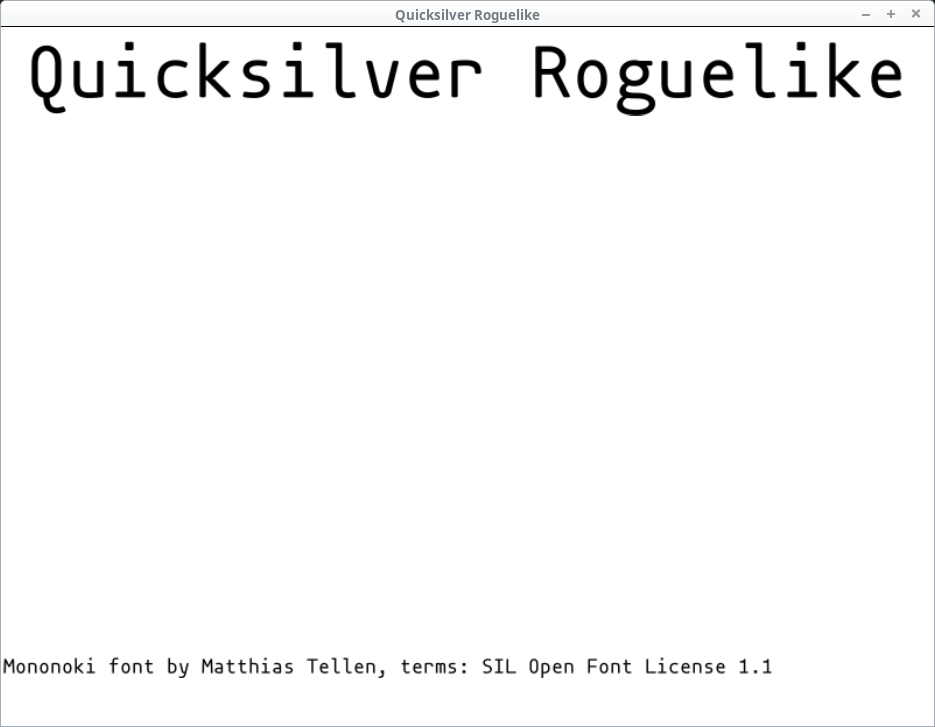

Not perfect, but it's easier on the eyes.

If you want to have a full control over your the window and text size,
add this line at the beginning of your `main` function:

```rust
std::env::set_var("WINIT_HIDPI_FACTOR", "1.0");
```

That will force the DPI to be 1.0. Games are more sensitive to scaling
than other application due to their pixel-based visual nature, so this
can be OK. However you ought to provide a way of scaling the UI from
within your game in that case! Ideally, defaulting to the system's DPI value.

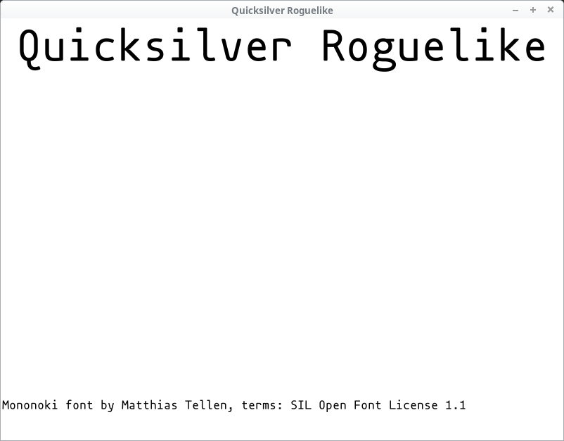

> We will still keep the `Blur` scaling strategy. Quicksilver's
> coordinates are floating point numbers and things like `with_center`
> can easily result in non-integer values. Again, these tend to look
> better with `Blur`.


## Generating the game map

Time to draw the actual game. We need a map and later on, the player,
some items and NPCs.

### Tiles

The map consists of tiles that look like this:

```rust
#[derive(Clone, Debug, PartialEq)]
struct Tile {
    pos: Vector,
    glyph: char,
    color: Color,
}
```

The `pos` is a [`quicksilver::geom::Vector`][vector]. Your typical
two-dimensional struct with `x` & `y` fields.

[vector]: https://docs.rs/quicksilver/0.3.5/quicksilver/geom/struct.Vector.html

> You might consider defining your own types for position, size, etc.
> `Vector` uses `f32` (you may prefer integers) and if you overload
> its meaning (e.g. using it for pixel as well as map tile
> coordinates), you can end up mixing them by accident.

A proper roguelike would use a procedural / random generation to build
the map. We're just going to create an empty rectangle with `#` as the
edges:

```rust
fn generate_map(size: Vector) -> Vec<Tile> {
    let width = size.x as usize;
    let height = size.y as usize;
    let mut map = Vec::with_capacity(width * height);
    for x in 0..width {
        for y in 0..height {
            let mut tile = Tile {
                pos: Vector::new(x as f32, y as f32),
                glyph: '.',
                color: Color::BLACK,
            };

            if x == 0 || x == width - 1 || y == 0 || y == height - 1 {
                tile.glyph = '#';
            };
            map.push(tile);
        }
    }
    map
}
```

We create a new [`Vec`][vec] (Rust's growable array type -- not
Quicksilver's `Vector`) and make it can hold all the tiles without
reallocating.

[vec]: https://doc.rust-lang.org/std/vec/struct.Vec.html

> If you know the size of a `Vec` in advance,
> call [with_capacity][with_capacity] instead of `new`. Pushing
> elements to it will be faster because it won't have to reallocate.

[with_capacity]: https://doc.rust-lang.org/std/vec/struct.Vec.html#method.with_capacity

And then we create all the `Tiles`. The ones at the edge will be `#`,
the rest is a `.`.

### Entities

While the map is the static environment (walls, water, floor, etc.),
entities are the interactive portions such as the player, items and NPCs.

The struct will have all the fields an entity might need:

```rust
#[derive(Clone, Debug, PartialEq)]
struct Entity {
    pos: Vector,
    glyph: char,
    color: Color,
    hp: i32,
    max_hp: i32,
}
```

> Yep this meens food and doors would have hit points. That's not as
> weird as it might seem (think of fire destroying everything by
> lowering HP -- that can apply to any entity not just living things).
> If you've got zillions entities however, storing every field for
> every entity may be inefficient. Check out
> the [entity-component-system pattern][ecs] for an alternative.

[ecs]: https://en.wikipedia.org/wiki/Entity%E2%80%93component%E2%80%93system

Our `generate_entities` just returns a hardcoded list:

```rust
fn generate_entities() -> Vec<Entity> {
    vec![
        Entity {
            pos: Vector::new(9, 6),
            glyph: 'g',
            color: Color::RED,
            hp: 1,
            max_hp: 1,
        },
        Entity {
            pos: Vector::new(2, 4),
            glyph: 'g',
            color: Color::RED,
            hp: 1,
            max_hp: 1,
        },
        Entity {
            pos: Vector::new(7, 5),
            glyph: '%',
            color: Color::PURPLE,
            hp: 0,
            max_hp: 0,
        },
        Entity {
            pos: Vector::new(4, 8),
            glyph: '%',
            color: Color::PURPLE,
            hp: 0,
            max_hp: 0,
        },
    ]
}
```

Two Goblin NPCs and some food.

Let's add the tiles and entities to our `Game` struct:

```rust
struct Game {
    title: Asset<Image>,
    mononoki_font_info: Asset<Image>,
    map_size: Vector,
    map: Vec<Tile>,
    entities: Vec<Entity>,
}
```

We're adding the size of the map as well -- that will come in handy
later.

Next, call both functions in `Game::new`:

```rust
let map_size = Vector::new(20, 15);
let map = generate_map(map_size);
let mut entities = generate_entities();
```

And make sure we actually return the new fields:

```rust
Ok(Self {
    title,
    mononoki_font_info,
    map_size,
    map,
    entities,
})
```

We need to add the player (represented, as always, by the `@` symbol),
too!

Having all the entities (monsters, items, NPCs, player, etc.) in one
place (the `entities` Vec) is quite useful, but the player character
is always a little special. We often need to access it directly to
show its health bar, update it's position on key presses, etc.

So let's also store the player's index. That way we can look them up
any time we want.

Put this in `Game::new` right after the `generate_entities()` call:

```rust
let player_id = entities.len();
entities.push(Entity {
    pos: Vector::new(5, 3),
    glyph: '@',
    color: Color::BLUE,
    hp: 3,
    max_hp: 5,
});
```

The player will have a blue colour and they will *not* be fully healed
(so we can see write a nice two-colour health bar later).

Add `player_id: usize` to our `Game` definition:

```rust
struct Game {
    title: Asset<Image>,
    mononoki_font_info: Asset<Image>,
    map_size: Vector,
    map: Vec<Tile>,
    entities: Vec<Entity>,
    player_id: usize,
}
```

And return it at the end of `new`:

```rust
Ok(Self {
    ...
    player_id,
})
```


## Building the tilemap

It's time to draw the map on the screen. We want to produce a grid of
letters that's potentially changing every frame (as the characters
move on the screen).

To do this we're going to build
a [spritesheet (also known as tileset or texture atlas)][tileset]. It
is a single image that will contain all of our graphics. The graphical
ones look something like this:

[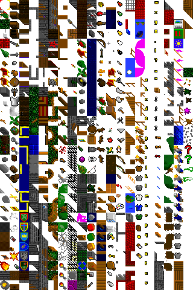][ts_example]

[ts_example]: https://en.wikipedia.org/wiki/File:Tile_set.png

[tileset]: https://en.wikipedia.org/wiki/Texture_atlas

*Author: Daniel Schwen, license: CC SA 4.0*

Ours is going to be built of letters not pictures, but the principle
is the same. And if you want, you can replace it with actual graphics
later.

> This is one of the reasons we'll build an atlas rather than calling
> `Font::render` for each character or line on the map. We'd have to
> do it for images and this lets us swap them out (or support both)
> later. Plus it's more efficient.

Games usually build these atlases during development and then only
ship the composite image. You only need to do it once, after all.

We're going to be a bit lazy and wasteful here, but you can (and
probably should) do that in your [build script][build_script] instead.

> One reason we do it in `main.rs` is that all our code is in one
> place. That makes this tutorial easier to follow. Not recommended
> for a bigger project.

[build_script]: https://doc.rust-lang.org/cargo/reference/build-scripts.html

First, we will list all the characters we're going to render. Put this
in `Game::new` after our entity code:

```rust
let game_glyphs = "#@g.%";
```

These are the characters we're going to use. A bigger game will have
more of these and you may want to generate them from your map and
entities instead of hardcoding them like we do.

Then we let Quicksilver do its thing and render it into an `Image`
just like before.

Drawing a part of an image is done via
the [`subimage` method][subimage]. You give it a `Rectangle` and
returns a new `Image` covering that portion and nothing else.

[subimage]: https://docs.rs/quicksilver/0.3.5/quicksilver/graphics/struct.Image.html#method.subimage

> This will *not* clone the image's contents. `Image` contains a
> reference-counted pointer back to the source, so the operation is
> quick and doesn't take up a lot of memory.

We could either call `subimage` directly in our `draw` function, or we
could generate a sub-image once for each glyph and then just reference
those when drawing. We're going to do the latter and use
a [`HashMap`][hashmap] to get from a `char` to the corresponding
`Image`.

[hashmap]: https://doc.rust-lang.org/std/collections/struct.HashMap.html

> There's a ton of other ways to do this. For example: create an image
> of all ASCII characters and then have all the subimages in a
> `Vec<Image>`. Each image's index would be its ASCII value. This
> would probably be faster, but it could waste a little more memory
> and you'll need to check that your `char` (a 32-bit Unicode value)
> can be converted to the right range. Also, what if you want to add
> some good-looking Chinese glyphs? You should measure and decide on
> trade-offs that suit your game.

We need to record the size of each tile (so we can pick it out of the
tileset). Our font is twice as tall as it is wide, so 24x12 pixels
should do nicely:

```rust
let tile_size_px = Vector::new(12, 24);
```

And build the tileset:

```rust
let tileset = Asset::new(Font::load(font_mononoki).and_then(move |text| {
    let tiles = text
        .render(game_glyphs, &FontStyle::new(tile_size_px.y, Color::WHITE))
        .expect("Could not render the font tileset.");
    let mut tileset = HashMap::new();
    for (index, glyph) in game_glyphs.chars().enumerate() {
        let pos = (index as i32 * tile_size_px.x as i32, 0);
        let tile = tiles.subimage(Rectangle::new(pos, tile_size_px));
        tileset.insert(glyph, tile);
    }
    Ok(tileset)
}));
```

The beginning is the same as our other font-rendering: we load the
font and build the image.

The rest creates a new `HashMap` and then creates a new sub-image for
every glyph.

> This relies on the fact that every glyph has the same width. In
> other words, it only works for monospace fonts such as ononoki. If
> you want to use a proportional font (say Helvetica), you will need
> to build the font-map yourself. You can use the `rusttype` library
> to do it.

Add the `tileset` and `tile_size_px` to the `Game` struct:

```rust
struct Game {
    title: Asset<Image>,
    mononoki_font_info: Asset<Image>,
    map_size: Vector,
    map: Vec<Tile>,
    entities: Vec<Entity>,
    player_id: usize,
    tileset: Asset<HashMap<char, Image>>,
    tile_size_px: Vector,
}
```

and return them from `new`:

```rust
Ok(Self {
    ...
    tileset,
    tile_size_px,
})
```

We need to add `quicksilver::geom::Rectangle` and
`std::collections::HashMap` to our imports:

```rust
use quicksilver::{
    geom::{Rectangle, Shape, Vector},
    graphics::{Background::Img, Color, Font, FontStyle, Image},
    lifecycle::{run, Asset, Settings, State, Window},
    Future, Result,
};

use std::collections::HashMap;
```


## Drawing the map

We've got the map and the tiles, so we can finally put them to use!

Drawing the map is easy: we calculate the position of each tile, grab
the corresponding image and draw it on the window. Since `tileset` is
an `Asset`, this must happen inside an `execute` block:

```rust
fn draw(&mut self, window: &mut Window) -> Result<()> {
    // ...

    let tile_size_px = self.tile_size_px;

    let (tileset, map) = (&mut self.tileset, &self.map);
    tileset.execute(|tileset| {
        for tile in map.iter() {
            if let Some(image) = tileset.get(&tile.glyph) {
                let pos_px = tile.pos.times(tile_size_px);
                window.draw(
                    &Rectangle::new(pos_px, image.area().size()),
                    Blended(&image, tile.color),
                );
            }
        }
        Ok(())
    })?;

    Ok(())
}
```

If we called `self.tileset.excute` without the `let` lines above it,
it would mutably borrow the entire `Game` struct and we wouldn't be
able to access `self.map` or `self.tile_size_px`. So we do a partial
borrow and call `execute` on that.

> Try removing the `let` lines and use `self.map` etc. in the `draw`
> function. See what happens!

The `Vector::times` method multiplies the corresponding Vector
elements. So `v1.times(v2)` is the same as: `Vector::new(v1.x * v2.x,
v1.y * v2.y)`. This gets us from the tile position (from `0` to `20`)
to the pixel position on the screen (from `0` to `240`).

> There are a few different ways to multiply vectors in Maths (cross
> product, dot product, per-element), so they're all available as
> separate methods with their own names instead the `v1 * v2` operator
> you might expect.

And finally, the `Blended` background option allows us to apply a
colour to the pixels on the picture. Since our glyphs are white, this
turns them into whatever colour we set.

We need to add it to our `use` statement:

```rust
quicksilver::graphics::Background::Blended
```

And that should do it:

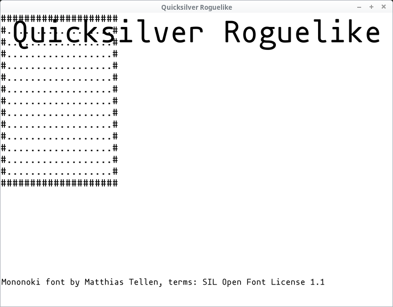

Looking good, but the map is in the top-left corner, obscured by the
title text! Let's fix that.

We'd like to move the whole map out of the title's way. That means
shifting each tile that we draw. Let's say `50` pixels to the right
and `120` down.

```rust
let offset_px = Vector::new(50, 120);
```

And then in `window.draw` we'll add `offset_px` to `pos_px ` in the
`Rectangle::new` call:

```rust
window.draw(
    &Rectangle::new(offset_px + pos_px, image.area().size()),
    Blended(&image, tile.color),
);
```

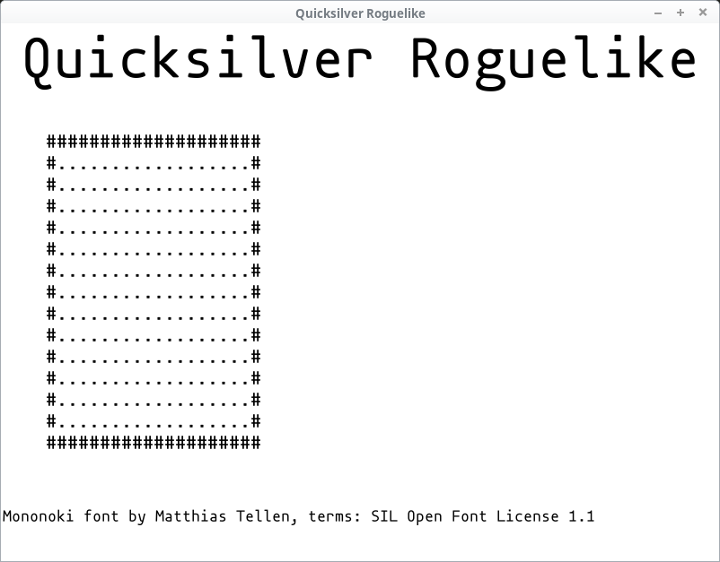

Better.


## Adding a square font

This starts to look like a roguelike, but we *can* improve upon it.
Why are the tiles not square? Personal preference aside (whatever
floats your boat), in our case it's just an artefact of the font we're
using.

We've picked mononoki, because we like it! It looks great, has
visually distinct characters and even normal text looks decent in it
(though when it comes to reading a block of actual text, nothing beats
proportional fonts).

> "we" == Tomas Sedovic. I like mononoki. It's awesome. If you
> disagree, pick a different font!

But it's not a square font.

If we were writing a terminal game or using a library that emulates
one (such as libtcod), everything would be the same font and you'd
have to choose between a square font (good for the map, bad for text)
or a non-square one (good for text, bad for the map).

Neither is a great option, but all old-school roguelikes were that
way.

We *can* do (arguably) better, however!

Let's just pick a second font with square proportions and use that for
the map (and keep doing text with mononoki).

For a font with square proportions, you clearly can't do better than
[Square][square]:

http://strlen.com/square/?s[]=font

[square]: http://strlen.com/square/?s[]=font

It's licensed under CC BY 3.0. Download it and put `square.ttf` in the
`static` folder.

> You can also just keep using a non-square font and simply center
> each glyph into a square tile. I did that in my first game. It's
> fine.

We'll need to tweak a few things in `Game::new`. We'll add the new
font file name and then replace `font_mononoki` in the `tileset`'s
`Font::load` with `font_square`:

```rust
let font_square = "square.ttf";
let game_glyphs = "#@g.%";
let tile_size_px = Vector::new(12, 24);
let tileset = Asset::new(Font::load(font_mononoki).and_then(move |text| {
    let tiles = text
        .render(game_glyphs, &FontStyle::new(tile_size_px.y, Color::WHITE))
        .expect("Could not render the font tileset.");
    let mut tileset = HashMap::new();
    for (index, glyph) in game_glyphs.chars().enumerate() {
        let pos = (index as i32 * tile_size_px.x as i32, 0);
        let tile = tiles.subimage(Rectangle::new(pos, tile_size_px));
        tileset.insert(glyph, tile);
    }
    Ok(tileset)
}));
```

You might wonder whether we should also update `tile_size_px`. We
should! Look what happens if we don't:

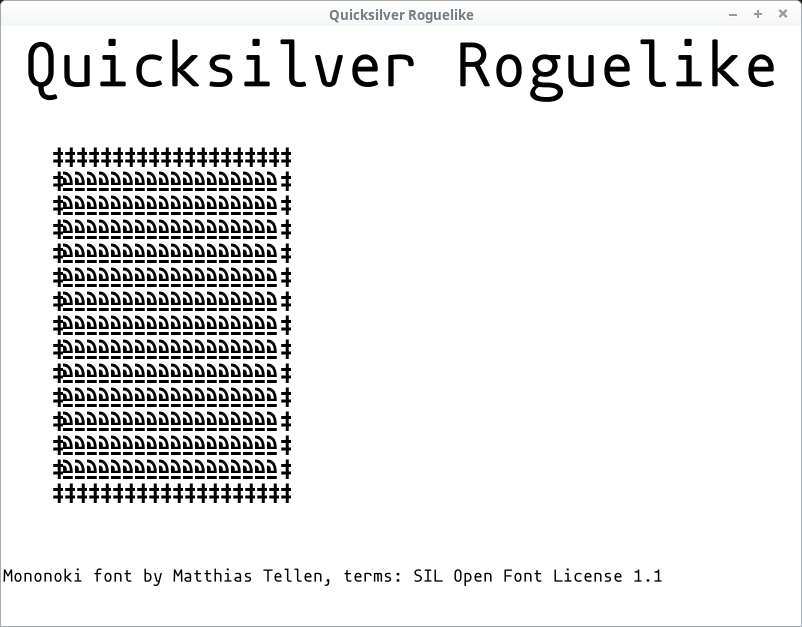

> Glitches like these are one of gamedev's lesser-known pleasures.

Make the tile size a proper square:

```rust
let tile_size_px = Vector::new(24, 24);
```

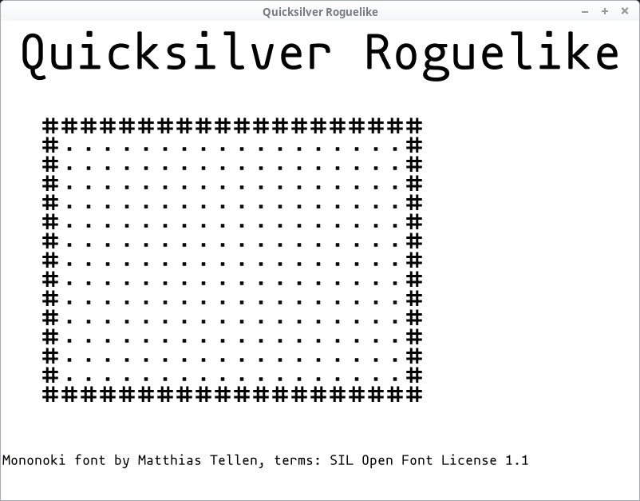

Take that, 1950s terminals!

> [Z3][z3], one of the first computers with a textual terminal had *1408
> bits* of data memory. Our tileset image *alone* has **11,520
> bytes**.

[z3]: https://en.wikipedia.org/wiki/Z3_(computer)

## Square credit

Since we've added another font, let's show our appreciation to its
author too!

In `Game::new`:

```rust
let square_font_info = Asset::new(Font::load(font_mononoki).and_then(move |font| {
    font.render(
        "Square font by Wouter Van Oortmerssen, terms: CC BY 3.0",
        &FontStyle::new(20.0, Color::BLACK),
    )
}));
```

Add it to the `Game` struct:

```
square_font_info: Asset<Image>,
```

And then in `Game::draw`:

```rust
self.square_font_info.execute(|image| {
    window.draw(
        &image
            .area()
            .translate((2, window.screen_size().y as i32 - 30)),
        Img(&image),
    );
    Ok(())
})?;
```

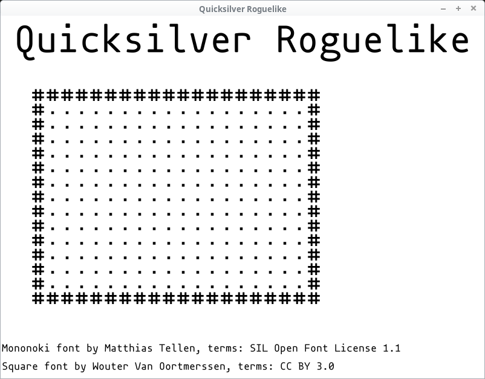

> Thanks a bunch, Wouter!


## Drawing entities

Now that our map looks the way we want it, let's add the entities. The
code is pretty much identical to how we draw the map:

```rust
let (tileset, entities) = (&mut self.tileset, &self.entities);
tileset.execute(|tileset| {
    for entity in entities.iter() {
        if let Some(image) = tileset.get(&entity.glyph) {
            let pos_px = offset_px + entity.pos.times(tile_size_px);
            window.draw(
                &Rectangle::new(pos_px, image.area().size()),
                Blended(&image, entity.color),
            );
        }
    }
    Ok(())
})?;
```

> It's so similar that you might consider using the same structure for
> both and draw everything in one block. That's perfectly feasible,
> give it a go!

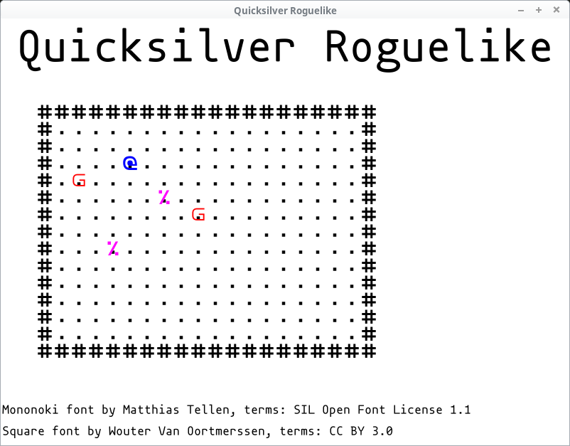

We can see the player (`@`) a couple of (definitely friendly) goblins
(`g`) and some purple food (`%`). Time to party!

You may also notice that the dots representing empty space are still
visible. The images are just drawn on top of one another so if they
don't cover something perfectly, it will peek through.

> Spoiler alert: we will not fix that here. It's your first homework!


## Health bar

One final piece of distinguished visual art: our protagonist's health bar!

We're going to get the player's entity, set the full bar's width at a
hundred pixels and calculate how much of it should we show based on
the player's hit points:

```rust
let player = &self.entities[self.player_id];
let full_health_width_px = 100.0;
let current_health_width_px =
    (player.hp as f32 / player.max_hp as f32) * full_health_width_px;
```

Next, let's calculate its position. We're going to place it at the
right hand side of the map. That means getting the map's size in
pixels plus the offset:

```rust
let map_size_px = self.map_size.times(tile_size_px);
let health_bar_pos_px = offset_px + Vector::new(map_size_px.x, 0.0);
```

And finally draw it. First we draw the full width in a somewhat
transparent colour and then the current value in full red:


```rust
// Full health
window.draw(
    &Rectangle::new(health_bar_pos_px, (full_health_width_px, tile_size_px.y)),
    Col(Color::RED.with_alpha(0.5)),
);

// Current health
window.draw(
    &Rectangle::new(health_bar_pos_px, (current_health_width_px, tile_size_px.y)),
    Col(Color::RED),
);
```

And we need to `use` `quicksilver::graphics::Background::Col`. That's
the final `Background` value -- representing the whole area filled
with the given colour.

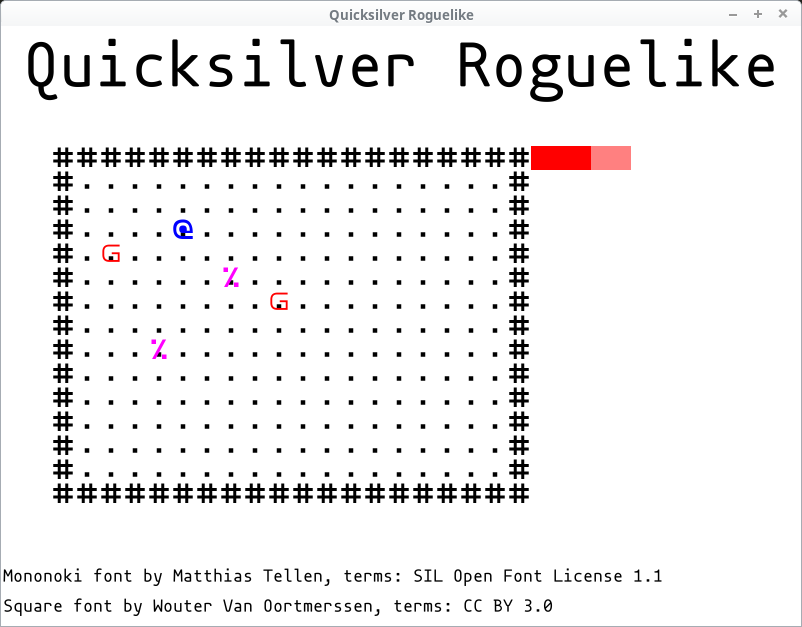


## Move the player around

Games have to be interactive. Let's move our player if any of the
arrow keys are pressed:

```rust
/// Process keyboard and mouse, update the game state
fn update(&mut self, window: &mut Window) -> Result<()> {
    use quicksilver::input::ButtonState::*;

    let player = &mut self.entities[self.player_id];
    if window.keyboard()[Key::Left] == Pressed {
        player.pos.x -= 1.0;
    }
    if window.keyboard()[Key::Right] == Pressed {
        player.pos.x += 1.0;
    }
    if window.keyboard()[Key::Up] == Pressed {
        player.pos.y -= 1.0;
    }
    if window.keyboard()[Key::Down] == Pressed {
        player.pos.y += 1.0;
    }
    Ok(())
}
```

Straightforward stuff.

Finally, if you want to quit the game, call `window.close()`:

```
if window.keyboard()[Key::Escape].is_down() {
    window.close();
}
```

> Please make sure you don't ship your game with this left in! Someone
> will press `Esc` unintentionally and lose their progress (or at
> least be annoyed they have to restart the game). That someone will
> be me. Please add a confirmation step before closing the window.

We'll need to add `quicksilver::input::Key` to our `use` declarations.

As you can see, the player can walk through everything. The goblins,
food, even the walls! This is fine if you're making a roguelike where
you're a ghost, but probably not in most other circumstances.

> We're not going to fix that here either! Your second homework.


## Web Version

One last thing.

Running the game with `cargo run` builds the desktop version. But we
promised that Quicksilver can do a web version too.

Run:

    $ cargo web start --auto-reload

and go to:

http://localhost:8000


It works! And it looks just like the desktop version. No changes
necessary.

If you run this:

```
$ cargo web deploy
```

Everything will be added to your `target/deploy` directory. Upload it
on the web, give people the link and they can play it right their in
the browser -- no need to install anything!

### GitHub Pages

You can publish your game to GitHub Pages like so. Assuming your
GitHub username is `sam` and your repo is called `roguelike`, you can
do this:

```
$ cd ~/code/roguelike  # or whetever your code is
$ git checkout -b gh-pages
$ cargo web deploy
$ cp -r target/deploy/* .
$ git add .
$ git commit -m "Add wasm build"
$ git push -u origin gh-pages
```

And now go to: `https://sam.github.io/roguelike/`

(of course swapping your user and repo name for the right values)

My repo is at `quicksilver-roguelike` and I'm @tomassedovic on GitHub,
so you can check out my build here:

https://tomassedovic.github.io/quicksilver-roguelike/


## Make your own game

This is where *we* end, but *you* are just beginning!

We've built something that has a lovely square map, readable text,
filled rectangles and runs on Windows, macOS, Linux and the *freaking
web*!

But it's not a real roguelike yet. In addition to the homework, it's
missing some of these things:

* procedural map generation
* collision handling
* monsters
* AI
* combat
* items

Plus whatever unique twists you want to do! Go make games!


## More resources

Quicksilver tutorial:

https://docs.rs/quicksilver/0.3.5/quicksilver/tutorials/index.html

Quicksilver API docs:

https://docs.rs/quicksilver/0.3.5/quicksilver/index.html

Rust's docs on `std::collections`:

https://doc.rust-lang.org/std/collections/index.html

> You will be using collections in your games and this is an excellent
> overview of what's in the standard library and when you might want
> to use it.

The 7 Day Roguelike Challenge (7DRL):

https://7drl.com/
